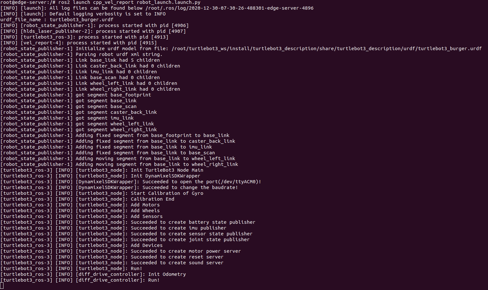

# 在Rb3上部署并启动控制程序

[](./Initiate_Robot.md)
[](./README_CN.md)

创建docker来启动机器人并实现机器人参数的发布<br>

```buildoutcfg
$ sudo docker run --rm -it --name robot --network host aarch64universal/turtlebot3ros2:0.1.1 bash 
```

设定环境变量ROS_DOMAIN_ID，BROKER_IP，TURTLEBOT3_MODEL<br>

```buildoutcfg
<docker>$ export ROS_DOMAIN_ID=<ROBOT's DOMAIN ID（在0-232之间）>
<docker>$ export BROKER_IP=<PC的IP地址>
<docker>$ export TURTLEBOT3_MODEL=burger
```

使用source命令执行setup.bash文件<br>

```buildoutcfg
<docker>$ source /root/turtlebot3_ws/install/setup.bash
```

在ROS文件包launch cpp_vel_report中执行文件robot_launch.launch.py<br>

 ```buildoutcfg
<docker>$ ros2 launch cpp_vel_report robot_launch.launch.py
```

成功启动机器人后可以看到如下结果<br>

 
 
 [](./System_Check_CN.md)