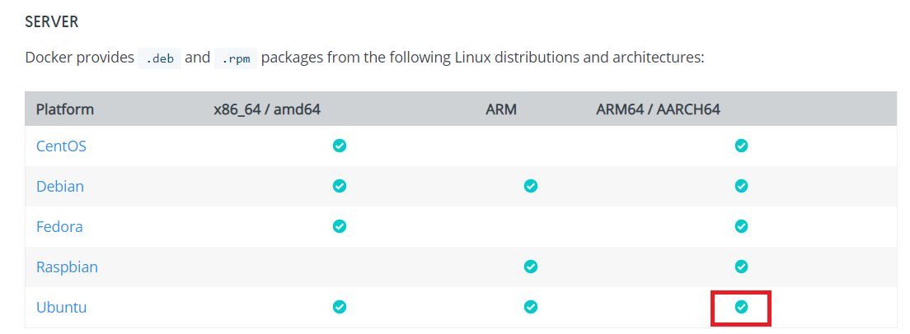

# 在PC上部署并启动EdgeX并创建设备

[](./Install_EdgeX.md)
[](./README_CN.md)

## 安装方法简介
Edgex的安装有多种方式。<br>
可以登录https://github.com/edgexfoundry 选择需要的project进行编译安装。<br>
也可以按照https://docs.edgexfoundry.org/1.2/getting-started/quick-start/的cocker-compose quick start方法进行安装。<br>
以下基于容器方法进行快速安装<br>
## 安装Docker 

除去按如下指令安装docker外，也可登陆Docker官网https://docs.docker.com/get-docker/后选择Docker for Linux，再选择Ubuntu Platform 中的ARM64/AARCH64后根据提示进行Docker安装
 
 
 
## 卸载旧版本
 旧版本的 Docker 被称为 docker、Docker.io 或 Docker-engine。如果安装了这些，请卸载它们：
```buildoutcfg
$ sudo apt-get remove docker docker-engine docker.io containerd runc
```
## 使用存储库安装

### 设置存储库
1.更新 apt 软件包索引并安装软件包，以便通过 HTTPS 访问存储库
 ```buildoutcfg
$ sudo apt-get update
$ sudo apt-get install \
   apt-transport-https \
   ca-certificates \
   curl \
   gnupg-agent \
   software-properties-common
```
2.添加 Docker 的官方 GPG 密钥：
 ```buildoutcfg
$ curl -fsSL https://download.docker.com/linux/ubuntu/gpg | sudo apt-key add -
```
通过搜索指纹的最后 8 个字符，请验证您现在有指纹 9DC8 5822 9FC7 DD38 854A E2D8 8D81 803C 0EBF CD88 的密钥。
```buildoutcfg
$ sudo apt-key fingerprint 0EBFCD88

pub   rsa4096 2017-02-22 [SCEA]
      9DC8 5822 9FC7 DD38 854A  E2D8 8D81 803C 0EBF CD88
uid           [ unknown] Docker Release (CE deb) <docker@docker.com>
sub   rsa4096 2017-02-22 [S]
```
3.使用以下命令设置稳定存储库。要添加夜间存储库或测试存储库，请在下面的命令中“稳定”一词后添加每晚添加单词或测试（或两者兼而有之）。
```buildoutcfg
$ sudo add-apt-repository \
   "deb [arch=arm64] https://download.docker.com/linux/ubuntu \
   $(lsb_release -cs) \
   stable"
```
### 安装 Docker 引擎
1.更新 apt 软件包索引，并安装最新版本的 Docker Engine 和容器，或前往下一步安装特定版本：
```buildoutcfg
$ sudo apt-get update
$ sudo apt-get install docker-ce docker-ce-cli containerd.io
```
2.通过运行 Hello-world 图像来验证 Docker 引擎是否安装正确。
```buildoutcfg
$ sudo docker run hello-world
```
此命令下载测试映像并在容器中运行。当容器运行时，它会打印一条信息消息并退出。
## 安装Docker-Compose

打开终端执行如下命令
```buildoutcfg
$ sudo apt install docker-compose
```
如果下载的系统版本低于ubuntu20.0，上述操作可能会使docker-compose版本过旧，影响后续安装，所以需要用pip3来安装docker-compose
安装pip3
```buildoutcfg
$ sudo apt install python3-pip
```
安装libffi
```buildoutcfg
$ sudo apt install libffi-dev
```
安装docker-compose
```buildoutcfg
$ sudo pip3 install docker-compose
```
当用pip3或者apt安装完成后测试docker-compose
```buildoutcfg
$ docker-compose -v
```
显示
```
Docker-compose version 1.xx.x, build unknown
```
## 运行EdgeX
一旦安装了 Docker 和 Docker Compose，您需要：<br>
下载/保存最新的 x86 编写文件：https://raw.githubusercontent.com/edgexfoundry/developer-scripts/master/releases/geneva/compose-files/docker-compose-geneva-redis-no-secty.yml<br>
```buildoutcfg
$ curl https://raw.githubusercontent.com/edgexfoundry/developer-scripts/master/releases/geneva/compose-files/docker-compose-geneva-redis-no-secty.yml -o docker-compose.yml; 
```
下载好后打开该文件进行修改<br>
1.取消对于device-mqtt的注释<br>
2.在volumes下添加挂载./device/mqtt:/res/docker<br>
3.添加mqtt-broker模块如下<br>
```buildoutcfg
  mqtt-broker:
    image: eclipse-mosquitto
    ports:
      - "1883:1883"
    container_name: mqtt-broker
    hostname: mqtt-broker
    networks:
      edgex-network:
        aliases:
            - mqtt-broker
```
最后整体修改结果如下图

 
 
 启动EdgeX容器
 ```buildoutcfg
$ sudo docker-compose up -d
```

 
 
 验证EdgeX容器已经启动
 ```buildoutcfg
$sudo docker-compose ps
```


[](./Run_Device_CN.md)