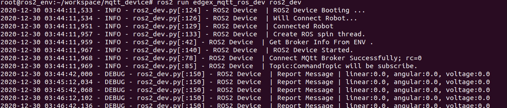

# 在Rb3上部署并启动程序device

[](./Run_Device.md)
[](./README_CN.md)

## 程序device的部署
首先将Rb3接通电源并将Rb3链接到与pc所在同一局域网络中<br>
并将Rb3与电脑链接<br>
通过adb指令访问Rb3

```buildoutcfg
$ adb shell
```

新建文件夹ros2<br>

```buildoutcfg
$ mkdir ros2
```

Crtl+d退出Rb3，将文件edgex_mqtt_ros2.tar拷贝进入Rb3的ros2目录下<br>

```buildoutcfg
$ adb push ~/edgex_mqtt_ros2.tar /ros2
```

重新通过adb指令进入Rb3，解压edgex_mqtt_ros2.tar文件到当前目录下<br>

```buildoutcfg
$ adb shell
$ tar -xvf edgex_mqtt_ros2.tar
```

创建配置好的ROS2环境的docker<br>

```buildoutcfg
$ sudo docker run --rm -it  --name ros2_env --hostname ros2_env \ 
  --network host -v $(pwd):/root/workspace ros:dashing-ros-core-bionic bash
```

docker启动后，在docker中安装pip3<br>

```buildoutcfg
<dokcker>$ apt-get update
<dokcker>$ apt-get install python3-pip
```

在docker中安装paho-mqtt的python库<br>

```buildoutcfg
<dokcker>$ pip3 install paho-mqtt
```

## 修改和编译
若有代码更新，需重新进行编译<br>
若加入新的节点需要修改setup.py<br>
若增加了ros包的引用需要修改package.xml<br>

```buildoutcfg
<dokcker>$ cd /root/workspace/mqtt_device/
<dokcker>$ apt install python3-colcon-common-extensions
<dokcker>$ colcon build
```

## 启动程序device

进入目录mqtt_device下<br>
使用source命令执行setup.bash文件<br>
设置环境变量ROS_DOMAIN_ID和BROKER_IP<br>
在ROS文件包edgex_mqtt_ros_dev中执行文件ros2_dev<br>

```buildoutcfg
<docker>$ cd /root/workspace/mqtt_device/
<docker>$ source ./install/setup.bash
<docker>$ export ROS_DOMAIN_ID=<ROBOT's DOMAIN ID（在0-232之间）>
<docker>$ export BROKER_IP=<PC的IP地址>
<docker>$ ros2 run edgex_mqtt_ros_dev ros2_dev
```

启动成功后会有如下显示<br>

 
 
 [](./Initiate_Robot_CN.md)