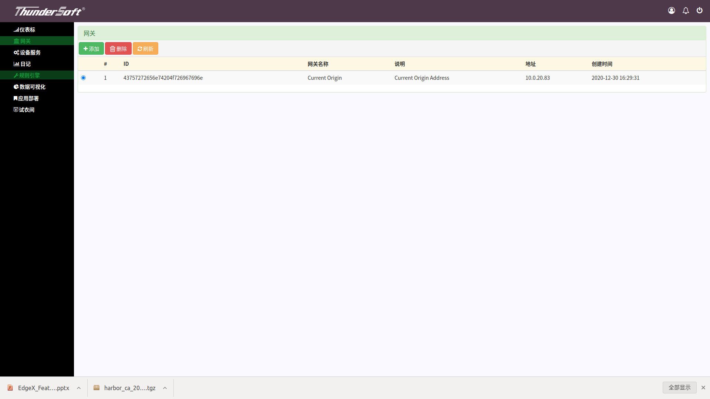
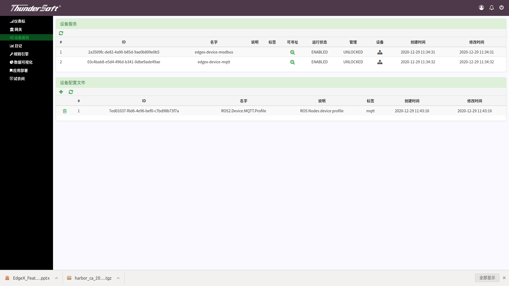
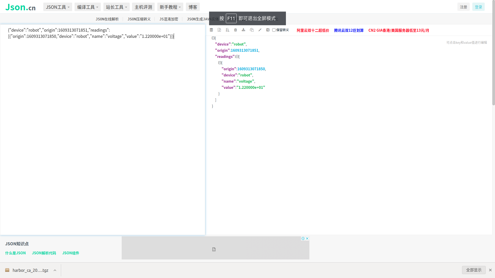
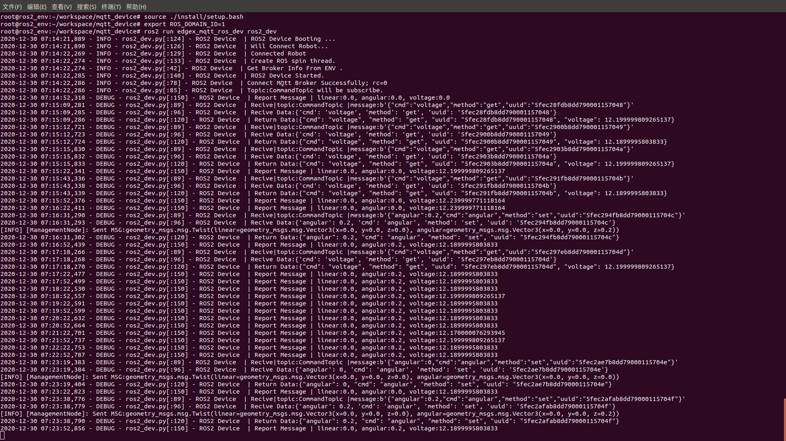

# Check whether the system is running successfully

Open the EdgeX page: (Local IP address):4000 
Choose a gateway. 

 
 
Click the device service button on the left. 

 
 
Because we use edgex-device-mqtt, click the corresponding device icon. 

 
 
The robot can then be set, the angular velocity, linear speed and the voltage of the robot can be controled and obtained. 
After getting the voltage instruction, you can copy the json file to interpret website, and then you can see the voltage inside the json file, as shown in the figure below. 

  
 
Setting the linear speed or angular velocity can see the sending of instructions in logs as shown in the figure below.
 
  
  
Corresponding movement of the robot as shown below.
  
  
  
Please click the button to watch the full video.
 
 