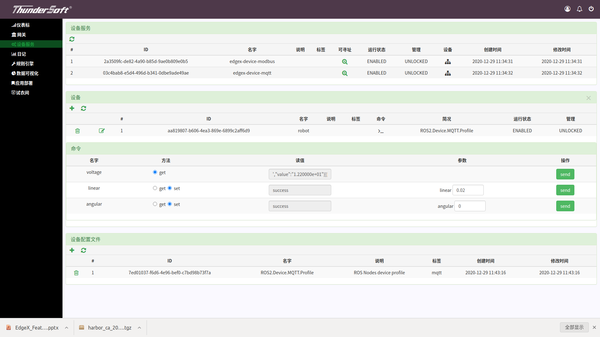
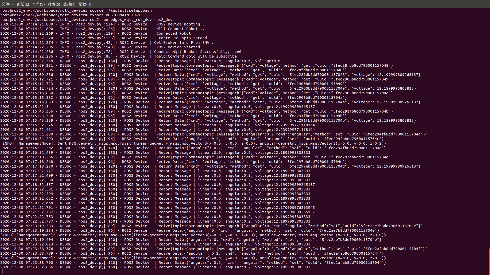

# 系统检验

打开EdgeX网页：<本机IP>:4000 
选取网关 

 
 
点击左侧设备服务
 
 
  
由于我们使用的是edgex-device-mqtt所以点击相对应的设备图标
  
 
   
之后可以对机器人进行设置，角速度线速度以及获取机器人的电压 
对电压进行get指令后可以得到json文件进行解读后可以看到电压，如下图

 

对线速度或角速度进行设定可以在log看到指令的发送如下图所示

 
 
 机器人相应运动如下图所示
 
 
 
 完整视频请点击按钮观看
 
 