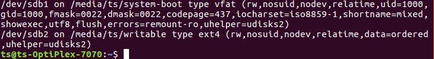
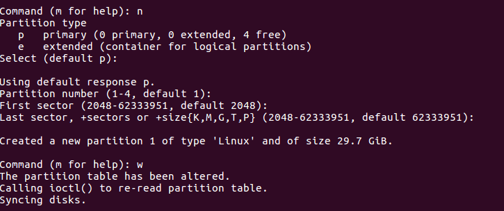
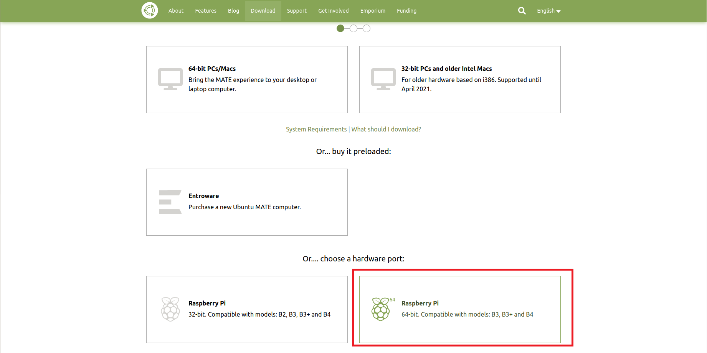
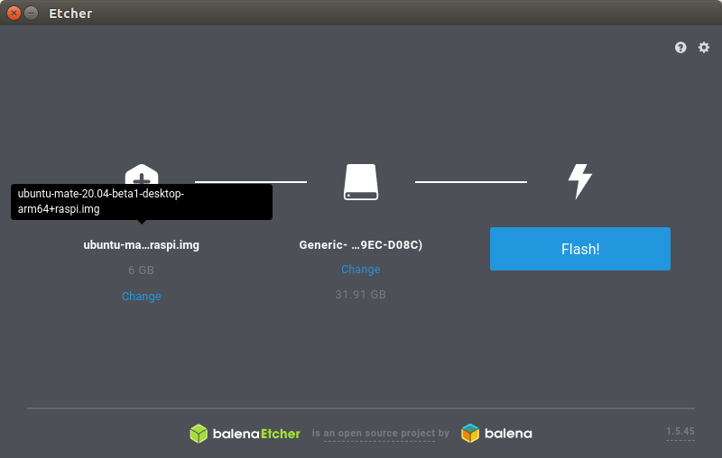
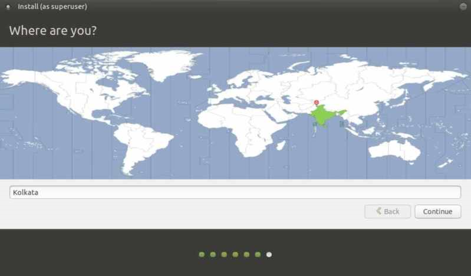
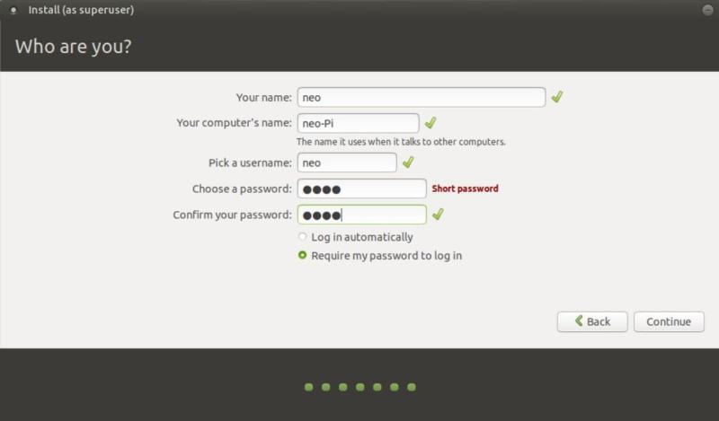
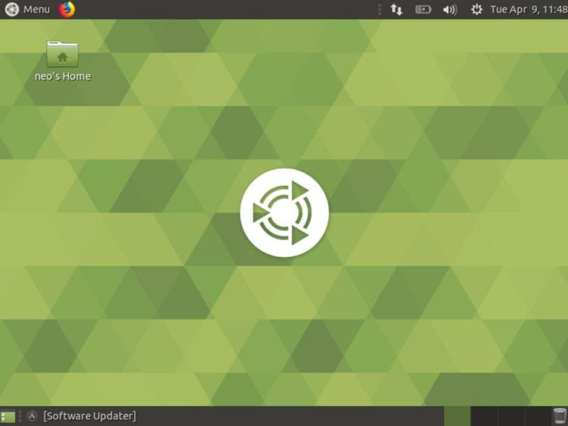
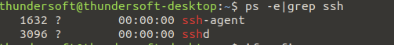
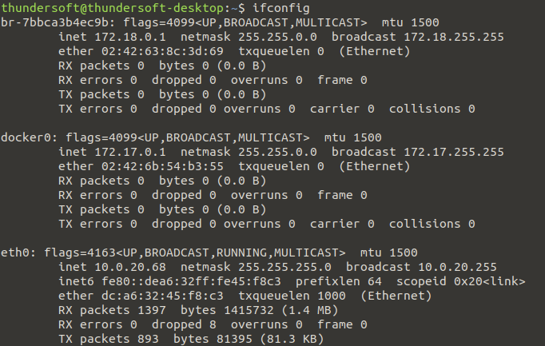
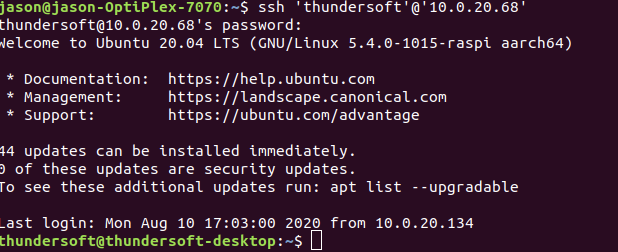

# Install Ubuntu MATE on Raspberry Pi

[](../RaspberryPi/Install_Operating_System_CN.md)

## device
Raspberry Pi 4b

## Set SD Card
After SD card is plugged into the card reader and connected to the computer, use the command 'mount' to check your partition (mostly on the last line) and find the mount directory of the SD card. It can be seen in the figure that the mount directory of this SD card is /dev/sdb1 and /dev/sdb1(it means that there are multiple partitions if there are sdb1, sdb2, etc., ).<br>
```
$ mount
```

 

Since SD card would mount automatically when plugged in, 'umount' is required.<br>
```
$ umount <pathname>  
eg :
$ umount /dev/sdb1
```

 

Use 'fdisk' to delete existing partitions and create a new partition<br>
```
$ sudo fdisk /dev/sdb 
```

Enter 'm' to see the command for help <br>
Enter 'd' to delete the partition (if there are multiple partitions, they should be deleted in turn). <br>
 
 
Enter 'n' to set SD card and select all the defaults (hit Enter).<br> 
Enter 'p' to choose Primary partition(by default).<br>
Enter '1' to set partition number 1. <br>
After SD card memory is set, input 'w' for storage.<br>
 

Finally, format the SD card.<br>
```
$ sudo mkfs.msdos /dev/sdb1 
``` 

## Download the Ubuntu Mate Image
Log in the Ubuntu Mate website: https://ubuntu-mate.org/download/ <br>
Select Raspberry Pi with 64-bit <br>
 
 
Select version 20.04 and download the image.<br>
 

Extract the package by following command.<br>
```
$ xz -d ubuntu-mate***.img.xz （ubuntu-mate***.img.xz is name of image file downloaded）
```
Extraction completed
 

## Burn the Image to a Formatted SD Card
Balena Etcher is needed to burn the image to SD card and create a file system of raspberry Pi .<br>
Log in to https://www.balena.io/etcher/, then download and install Linux version Balena Etcher installation package.<br>
Unzip the installation package and install Balena Etcher.<br>
```
$ unzip zipped_file.zip (zipped_file is the name of installation package).
```

Run the Etcher, select the image file and SD card, and then click Flash to burn.<br>
 

 

Balena Etcher interface is shown in the figure when burnt successfully. <br>
 

## start-up the Raspberry Pi
You'll need some peripherals to use Raspberry Pi, such as:<br>
 mouse <br>
 keyboard <br>
 HDMI cable <br>

### Connecting external devices
1. Insert a mouse and a keyboard, and connect the HDMI cable.<br>
2. Insert the SD card into the SD card slot.<br>
3. Plug in a power cord to power it. Make sure you have a good power supply (5V, 3A). A poor power supply can degrade performance.<br>
 

 

## Set Up the System
When the Raspberry Pi is connected to the monitor, launch the Raspberry Pi system to configure, select the environment language and the region.<br>
 

 
 
Select your WiFi network and enter your password into the network connection.<br>
 

After setting your keyboard layout, time zone, and user credentials, you will be taken to the login screen in a few minutes.<br>
 

## Connect Equipment
 1. Monitor
 2. ssh
Put Raspberry Pi and PC in the same LAN, enter the following command on the Raspberry Pi terminal, Check whether the SSH service is running.<br>
```
$ systemctl status sshd.service
```

If not, execute the following command. Enter Yes enter to continue the installation.<br>
```
$ sudo apt install openssh-server
```

After installation, continue to see more SSHD, you can use the PC remote login Raspberry pi.<br>
```
$ ps -e|grep ssh
```
 

After the terminal inputs ifconfig, view the Raspberry Pi IP address on the eth0 port.<br>
```
1. $ ifconfig
```

 

Type SSH 'your username '@' Raspberry Pi IP address' into your PC and enter a password to SSH the Raspberry Pi file.<br>
```
$ ssh 'xxxxxxx'@'xx.xx.xx.xx'
```
 
