# 在树莓派上安装Ubuntu MATE

[](../RaspberryPi/Install_Operating_System.md)

## 设备
Raspberry Pi 4b

## 设置SD卡
将sd卡插在读卡器上连接到电脑主机后，使用命令mount在最后一行查看自己的设备号,找寻sd卡的挂载目录，如图可以看到此sd卡的挂载目录为/dev/sdb1(若有sdb1,sdb2等，则说明有多个分区)。
```
$ mount
```

 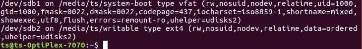
 
 由于sd卡插上之后会自动mount，所以需要unmout
 ```
$ umount 路径名   (此sd卡的例子为：umount /dev/sdb1）
```

 

使用fdisk删除已存在的分区并创建新分区
```
$ sudo fdisk /dev/sdb  
```
如图所示，输入m，可看到命令获取帮助，之后输入d删除分区（若有多个分区，需要依次删除）。

 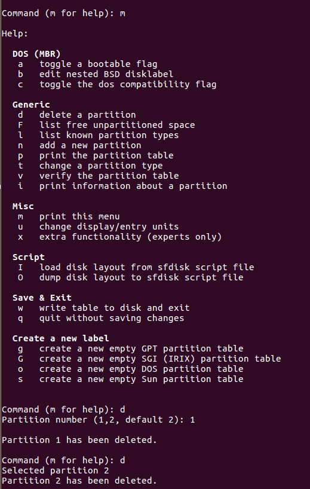
 
之后在sd卡内存设定时全部选择默认（敲击回车），系统会自动选择default后显示的内容（也可以先输入n创建新分区，后输入p选择primay分区，后输入1选择第1分区号，后若sd卡的内存是32GB，则输入2048与62333951表示first sector与last sector）。在sd卡内存设定结束后，输入w进行储存。

 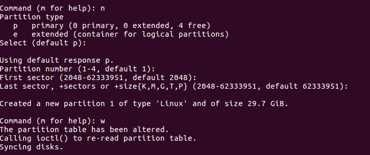
 
 
最后格式化sd卡
```
$ mkfs.msdos /dev/sdb1 （若选择了第一分区号，则是mkfs.msdos /dev/sdb1）
```
## 下载Ubuntu Mate镜像

Ubuntu MATE 是仅有的原生支持树莓派且包含一个完整的桌面环境的发行版,选择安装Ubuntu Mate是最简单和快速的。<br>
登录Ubuntu Mate官网https://ubuntu-mate.org/download/<br>
选择Raspberry Pi 64位 镜像进入后，再选择20.04版本并下载镜像。<br>
 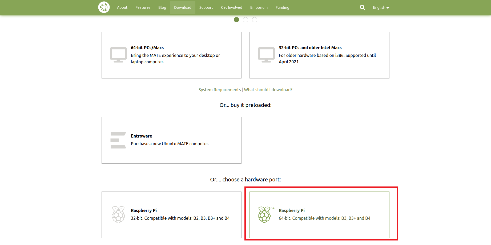
 
 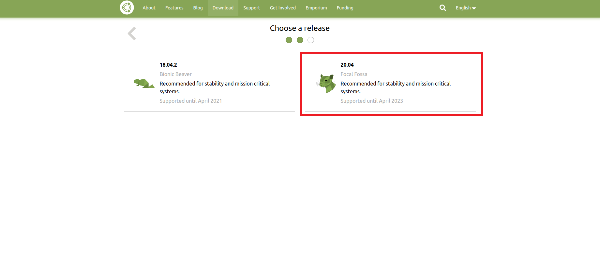
 
 镜像文件一旦下载完成后需要解压。请使用下面命令进行解压。
```
$ xz -d ubuntu-mate***.img.xz  （ubuntu-mate***.img.xz是你下载的镜像的名字）
```
如下图所示即为镜像文件的.img.xz与.img形式。

 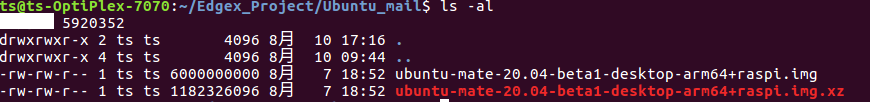
 
## 将镜像烧录至格式化好的SD卡中

需要用Balena Etcher工具烧写SD卡，制作树莓派的文件系统。<br>
登录https://www.balena.io/etcher/后下载安装Linux版本Balena Etcher的安装包。<br>
解压安装包并且安装Balena Etcher.
```
$unzip zipped_file.zip (zipped_file是安装包的名字)
```

 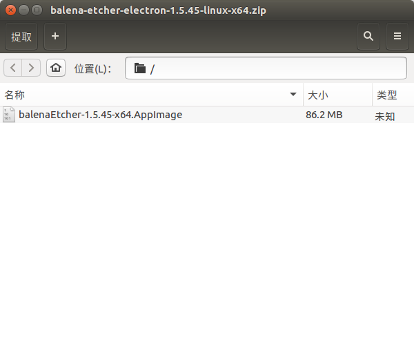
 
 启动 Etcher，选择镜像文件和 SD 卡，后点击Flash进行烧写。
 
 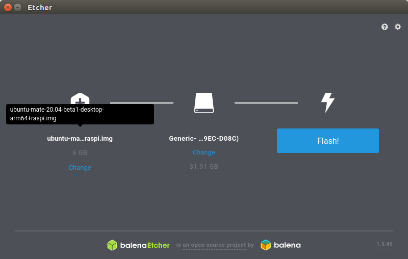
  
 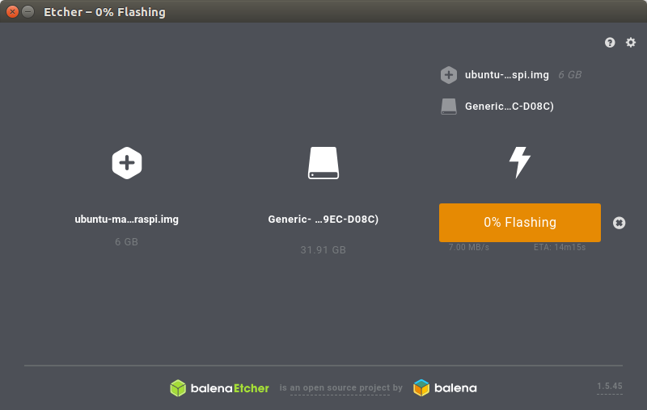
  
  当烧写成功后，balena Etcher界面如图所示
   
 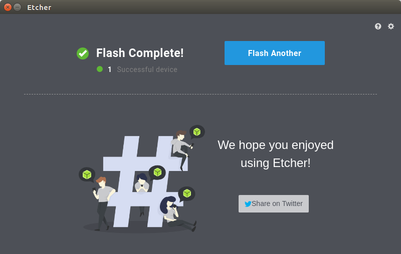
 
## 连接外部设备

你需要一些外设才能使用树莓派，例如鼠标、键盘、HDMI 线等等。<br>
插入一个鼠标和一个键盘。<br>
连接 HDMI 线缆。<br>
插入 SD 卡 到 SD 卡槽。<br>
插入电源线给它供电。确保你有一个好的电源供应（5V、3A ）。一个不好的电源供应可能降低性能。<br>
 

 
 
## 配置系统
 
 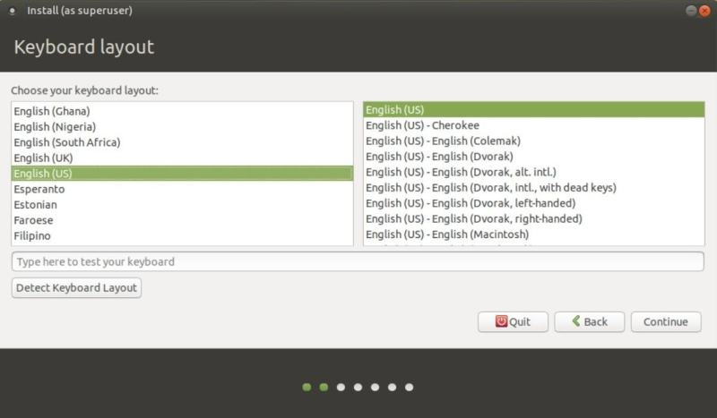

 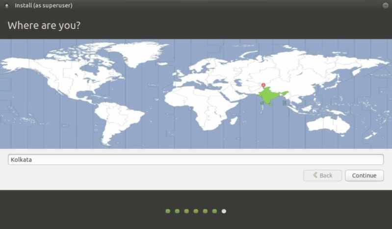
 
 

 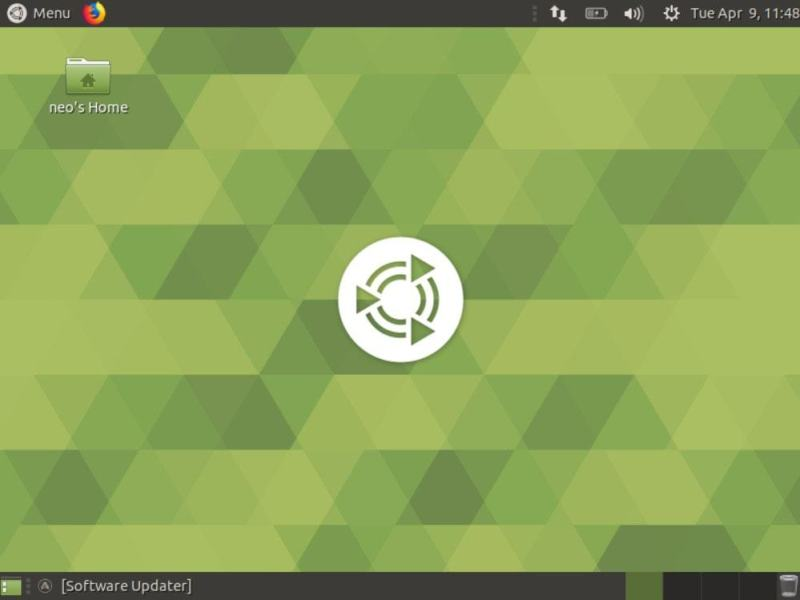
  
## 连接设备

   1. 显示器，键盘，鼠标
   2. ssh
将树莓派和pc电脑置于同一个局域网下，在树莓派终端上输入如下命令,看到只有ssh-agent 这个是ssh-client客户端服务，如果有sshd，证明你已经装好了ssh-server并已启用。

```
$ ps -e|grep ssh
```
如果没有，那就执行如下命令。输入yes回车继续安装。
```
$ sudo apt install openssh-server
```
 
 安装完成后，再继续执行看到多了一个sshd，则可以用pc机远程登陆树莓派。
 ```
$ ps -e|grep ssh
```

 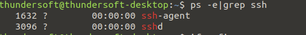
 
 终端输入ifconfig后，在eth0端口查看树莓派的ip地址
  ```
$ ifconfig
```


 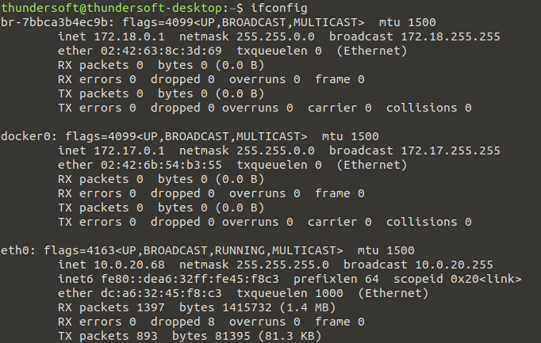
 
 在pc机中输入ssh '你的用户名'@'树莓派ip地址',并输入密码就可以通过ssh处理树莓派文件。
```
$ ssh 'xxxxxxx'@'xx.xx.xx.xx'
```

 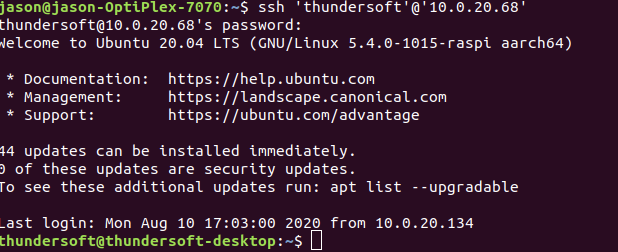
